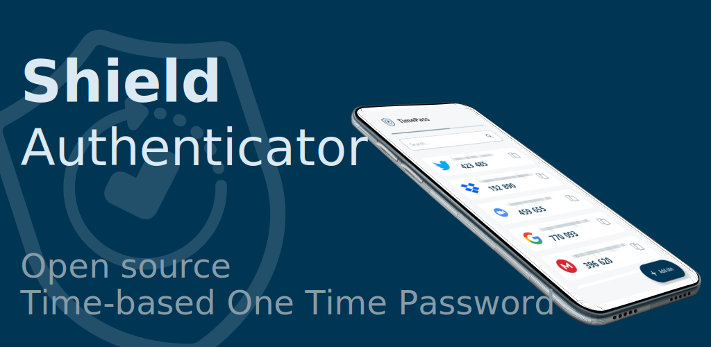
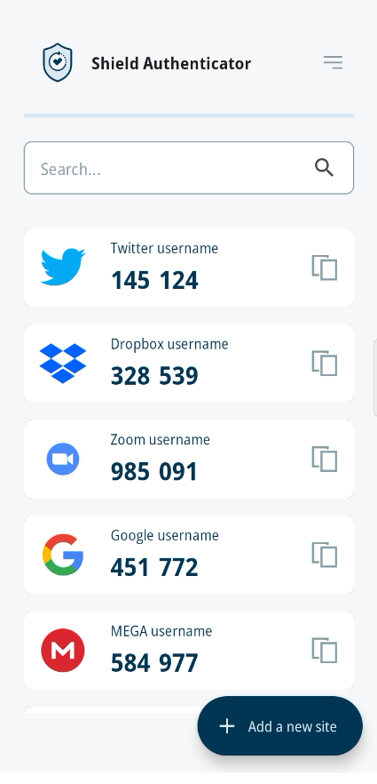

[](https://play.google.com/store/apps/details?id=com.displaynone.timepass)

# Shield Authenticator

An open source TOTP (Time-based One Time Password) Android app.


## What is TOTP

It is a security protocol used to generate a unique password that changes every certain amount of time (usually 30 or 60 seconds) and can only be used once. TOTP is commonly used in two-factor authentication (2FA) systems, where users are required to provide a password along with a TOTP code to verify their identity. The TOTP code is generated using a shared secret key and the current time, ensuring that the code is valid only for a short period of time and cannot be reused by an attacker.

**Shield Authenticator** is an open-source project that aims to provide an alternative to commercial two-factor authentication (2FA) apps like Google Authenticator or Authy. It uses the TOTP protocol to generate one-time passwords, just like these apps do. However, because it is open source, users can review the code and ensure that there are no hidden backdoors or vulnerabilities that could be exploited by attackers. Shield Authenticator is free to use and can be installed on Android mobile devices.



## Developers

Join Shield Authenticator, the open-source alternative to Google Authenticator and Authy. Help us create a more secure future for online authentication. Contribute code, report bugs, or just spread the word. Let's make online security accessible for everyone!

### Tech stack

Timepass is a mobile application built on the React Native framework, utilizing the Expo development environment, TypeScript for improved type safety and scalability, LinguiJS for internationalization, and WatermelonDB for efficient data management.

### Installation

Clone this project and execute:

```
npm i
```

### Usage

Connect your device to the USB port and run:

```
npm run android
```

or

```
npx expo run:android
```

#### Test Github Actions

```
act --secret-file .env --env-file .env -j preview
```

##### More info

- [List of 2FA sites](https://2fa.directory/)

## Screenshots

[English](./docs/captures/en/screenshots.md) | [Español](./docs/captures/es/screenshots.md) | [Italiano](./docs/captures/it/screenshots.md) | [Deutsch](./docs/captures/de/screenshots.md) | [العربية](./docs/captures/ar/screenshots.md) | [中文](./docs/captures/zh/screenshots.md) | [Français](./docs/captures/fr/screenshots.md)