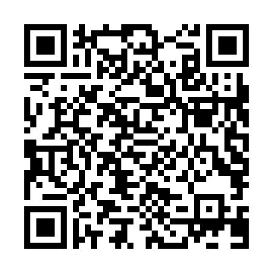

# TOTP QR Code Examples

The QR codes below represent examples of TOTP services offered by different companies and organizations. Each QR code includes a secret key that is required to generate a temporary, one-time password. Please note that the secret keys included in these examples are invalid and should not be used for actual authentication purposes.

To try out these TOTP services, you can use a TOTP app like Shield Authenticator to scan the QR codes and generate the one-time passwords. This can help you better understand how TOTP services work and how they can be used for two-factor authentication.

| Image Name | Image Preview |
|------------|---------------|
| algolia.png |  |
| arduino.png |  |
| auth.mongodb.com.png |  |
| bitbucket.png |  |
| box.png |  |
| bugsnag.png |  |
| cloudflare.png |  |
| digitalocean.png |  |
| discord.png |  |
| dropbox.png |  |
| expo.png |  |
| figma.png |  |
| github.png |  |
| gitlab.com.png |  |
| google.png |  |
| heroku.png |  |
| hub.docker.com.png |  |
| invisionapp.png |  |
| jetbrains_account.png |  |
| ko-fi.png |  |
| localize.png |  |
| mega.png |  |
| microsoft.png |  |
| mxtoolbox.png |  |
| npm.png |  |
| packagist.png |  |
| patreon.png |  |
| poeditor.png |  |
| postman.png |  |
| pypi.png |  |
| slack.png |  |
| sketch.png |  |
| updraftplus.com.png |  |
| twitter.png |  |
| vultr.png |  |
| wetransfer-prod.png |  |
| zoom.png |  |
| zoho.png |  |
